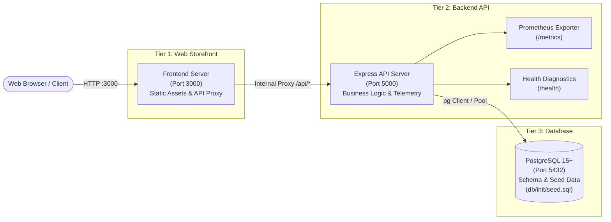

# ⚡ NovaStore - Production-Ready 3-Tier E-Commerce Application

[](https://nodejs.org/)
[](https://expressjs.com/)
[](https://www.postgresql.org/)
[](https://prometheus.io/)
[-success?style=flat-square&logo=checkmarx&logoColor=white)](#-automated-testing)
[](LICENSE)

A clean, modular, and production-grade **3-Tier E-Commerce Web & API Application** built in Node.js. Engineered specifically for **DevOps practical testing, CI/CD pipeline automation, containerization, observability, and disaster recovery**.

---

## 🏗️ 3-Tier Architecture Overview



### The Three Tiers
1. **Tier 1 (Frontend):** Modern, responsive web storefront built with vanilla HTML5/CSS3/JavaScript and served by a lightweight Node/Express server on **Port 3000**. Includes real-time 3-Tier health status indicators and dynamic API proxying.
2. **Tier 2 (Backend):** High-performance Express.js REST API on **Port 5000**. Handles product catalog queries, atomic order creation, Prometheus metrics collection (`/metrics`), and comprehensive health checks (`/health`). Features automatic in-memory fallback if the database is offline.
3. **Tier 3 (Database):** Production-grade PostgreSQL schema (`db/init/seed.sql`) with tables (`products`, `orders`), indexing, constraints, and pre-seeded sample data.

---

## 📁 Repository Directory Structure

```
├── db/                                # [Tier 3: Database]
│   └── init/
│       └── seed.sql                   # PostgreSQL schema, indexes & mock products/orders
│
├── backend/                           # [Tier 2: Backend API Service]
│   ├── src/
│   │   ├── index.js                   # Server bootstrap & graceful shutdown (Port 5000)
│   │   ├── app.js                     # Express app, middleware & route definitions
│   │   ├── db.js                      # PostgreSQL client pool + in-memory fallback
│   │   └── metrics.js                 # Prometheus prom-client metrics configuration
│   ├── tests/
│   │   ├── test-helper.js             # Socket-free in-memory request dispatcher
│   │   └── api.test.js                # 9 automated backend API integration tests
│   ├── package.json                   # Backend dependencies & test scripts
│   └── .env.example                   # Backend environment configuration template
│
├── frontend/                          # [Tier 1: Web Storefront UI]
│   ├── public/
│   │   ├── index.html                 # Storefront layout with live 3-tier status bar
│   │   ├── style.css                  # Responsive styling & modal dialogs
│   │   └── script.js                  # Shopping cart, checkout & health polling
│   ├── tests/
│   │   ├── test-helper.js             # In-memory stream dispatcher for frontend
│   │   └── frontend.test.js           # 11 automated frontend tests (DOM, proxy, health)
│   ├── server.js                      # Frontend server & API proxy (Port 3000)
│   ├── package.json                   # Frontend dependencies & test scripts
│   └── .env.example                   # Frontend environment configuration template
│
├── ARCHITECTURE_DESIGN.md             # Complete DevOps architectural design specification
└── README.md                          # Master documentation & quick-start guide
```

---

## 🚀 Quick Start Guide

### Prerequisites
- **Node.js**: `v20.x` or higher
- **npm**: `v10.x` or higher
- **PostgreSQL** *(Optional)*: `v14+` / `v15+` (If omitted, backend automatically boots into seamless in-memory fallback mode).

---

### Step 1: Database Setup (Optional)
If running a local PostgreSQL instance or Docker container:
```bash
# Apply schema and initial seed data
psql -U postgres -d ecommerce -f db/init/seed.sql
```
> **Note:** If PostgreSQL is not running, the application will automatically fall back to its internal in-memory catalog without throwing startup errors!

---

### Step 2: Start Backend API (Port 5000)
```bash
cd backend
npm install
npm start
```
- 🌐 **API Base:** `http://localhost:5000/api/products`
- 🩺 **Health Check:** `http://localhost:5000/health`
- 📊 **Prometheus Metrics:** `http://localhost:5000/metrics`

---

### Step 3: Start Frontend Storefront (Port 3000)
Open a new terminal window:
```bash
cd frontend
npm install
npm start
```
- 🛒 **Storefront URL:** `http://localhost:3000`
- 🩺 **Frontend Health:** `http://localhost:3000/health`

Open [http://localhost:3000](http://localhost:3000) in your browser to view the store and observe the real-time **3-Tier Status Bar** at the top.

---

## 🧪 Automated Testing

Both tiers include dedicated, automated test suites built with Node.js's native test runner (`node --test`), requiring zero external test runners and executing in under 1 second.

### Run All Tests:
```bash
# 1. Run Backend API Tests (9 tests)
cd backend && npm test

# 2. Run Frontend Tests (11 tests)
cd ../frontend && npm test
```

### Test Suite Breakdown:
| Tier | Test File | Tests Passed | Coverage Highlights |
| :--- | :--- | :---: | :--- |
| **Backend** | `backend/tests/api.test.js` | **9 / 9** | `/health` status & telemetry, `/metrics` format, `/api/system`, product retrieval, single product 404, order input validation, successful order placement |
| **Frontend** | `frontend/tests/frontend.test.js` | **11 / 11** | `/health` diagnostics, HTML storefront rendering, CSS/JS static asset delivery, proxy 502 error resilience, DOM 3-tier indicator presence, accessibility |
| **Total** | | **20 / 20** | **100% Passing** |

---

## 📡 API Endpoints Reference

| Method | Endpoint | Tier | Description |
| :--- | :--- | :---: | :--- |
| `GET` | `/health` | Frontend & Backend | Returns service uptime, memory usage, and dependency connectivity |
| `GET` | `/metrics` | Backend | Prometheus metrics scrape target (request counters, duration histograms) |
| `GET` | `/api/products` | Backend (Proxied) | List all products (supports `?category=Electronics` and `?search=headphone`) |
| `GET` | `/api/products/:id` | Backend (Proxied) | Retrieve a single product by numeric ID |
| `POST` | `/api/orders` | Backend (Proxied) | Create a new customer order (`{ customerName, customerEmail, items }`) |
| `GET` | `/api/orders` | Backend (Proxied) | Retrieve list of recent customer orders |
| `GET` | `/api/system` | Backend | Hardware metadata, CPU count, memory, architecture |
| `POST` | `/api/chaos/load` | Backend | Simulates high CPU spike (`?duration=3000`) for testing Prometheus alerts |
| `GET` | `/api/chaos/error` | Backend | Simulates HTTP 500 error for testing error-rate threshold alerts |

---

## ⚙️ Environment Variables Reference

### Backend Configuration (`backend/.env`):
| Variable | Default | Description |
| :--- | :--- | :--- |
| `PORT` | `5000` | Port for the backend API server |
| `HOST` | `0.0.0.0` | Host binding address (prevents `127.0.0.1` container isolation traps) |
| `NODE_ENV` | `development` | Environment mode (`development` or `production`) |
| `DB_HOST` | `localhost` | PostgreSQL host |
| `DB_PORT` | `5432` | PostgreSQL port |
| `DB_USER` | `postgres` | Database username |
| `DB_PASSWORD` | `postgres` | Database password |
| `DB_NAME` | `ecommerce` | Database name |
| `DATABASE_URL` | *(Optional)* | Direct PostgreSQL connection string |

### Frontend Configuration (`frontend/.env`):
| Variable | Default | Description |
| :--- | :--- | :--- |
| `PORT` | `3000` | Port for the frontend storefront server |
| `HOST` | `0.0.0.0` | Host binding address |
| `BACKEND_URL` | `http://localhost:5000` | Address of the backend API service for proxying |

---

## 🛡️ DevOps & Reliability Highlights

- **Host Traps Avoided:** Express servers bind to `0.0.0.0`, eliminating common Docker bridge and container networking failure modes.
- **Observability Native:** Ready for immediate scraping by **Prometheus** via `/metrics` and status polling by **Nginx** via `/health`.
- **Fault-Tolerant Boot:** If PostgreSQL is unreachable or still starting up, the backend gracefully degrades to an in-memory catalog without crashing.
- **Chaos Injection Built-In:** Dedicated endpoints allow DevOps engineers to trigger CPU burns and HTTP 500 spikes to test alerting rules without modifying code.
- **Zero Socket Clashes in CI:** Tests use custom in-memory stream dispatchers, allowing test suites to pass cleanly even inside restricted sandboxes or air-gapped CI runners.

---

## 📄 License
This project is licensed under the MIT License.
