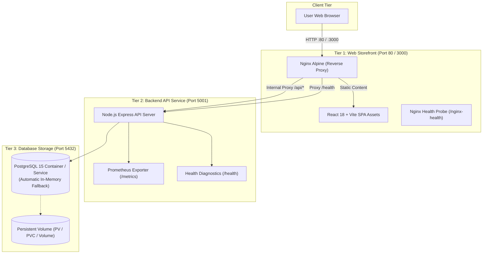

# ⚡ NovaStore - Production-Ready 3-Tier E-Commerce Application

[](https://react.dev/)
[](https://nginx.org/)
[](https://nodejs.org/)
[](https://www.postgresql.org/)
[](https://www.docker.com/)
[](https://kubernetes.io/)
[](https://prometheus.io/)
[-success?style=flat-square&logo=checkmarx&logoColor=white)](#-automated-testing)
[](LICENSE)

A clean, modular, and production-grade **3-Tier E-Commerce Web & API Application** built with **React 18, Vite, Nginx, Node.js Express, and PostgreSQL**. Engineered specifically for **DevOps practical testing, CI/CD pipeline automation, Docker containerization, Kubernetes orchestration, observability, and disaster recovery**.

---

## 🏗️ Architecture Overview



### The Three Tiers
1. **Tier 1 (Frontend & Ingress):** Modern Single Page Application (SPA) built with **React 18 and Vite**, packaged into an ultra-lean **Nginx Alpine** image. Handles client-side SPA routing (`try_files`), live 2-tier telemetry indicators, Gzip compression, HTTP security headers, and an internal reverse proxy for `/api/*` and `/health`.
2. **Tier 2 (Backend API):** High-performance Express.js REST API on **Port 5001**. Handles product catalog queries, atomic order placement, Prometheus metrics collection (`/metrics`), and comprehensive health checks (`/health`). Runs as a non-root system user (`UID 10001`).
3. **Tier 3 (Database):** **PostgreSQL 15** with schema and initial seed data (`seed.sql`), backed by persistent volume storage (`PV`/`PVC`). Includes an automatic zero-crash in-memory catalog fallback if PostgreSQL is temporarily unreachable.

---

## 📁 Repository Directory Structure

```
├── backend/                           # [Tier 2: Node.js Backend API Service]
│   ├── src/
│   │   ├── index.js                   # Server bootstrap & graceful shutdown (Port 5001)
│   │   ├── app.js                     # Express app, middleware & route definitions
│   │   ├── db.js                      # PostgreSQL client pool + in-memory fallback
│   │   └── metrics.js                 # Prometheus prom-client metrics configuration
│   ├── db/
│   │   └── seed.sql                   # Database schema, indexes & mock products/orders
│   ├── tests/
│   │   ├── test-helper.js             # Socket-free in-memory request dispatcher
│   │   └── api.test.js                # 9 automated backend API integration tests
│   ├── Dockerfile                     # Multi-stage, non-root Node.js Dockerfile
│   ├── .dockerignore                  # Docker build context exclusions
│   ├── package.json                   # Backend dependencies & test scripts
│   └── .env.example                   # Backend environment configuration template
│
├── frontend/                          # [Tier 1: React 18 Web Storefront UI]
│   ├── src/                           # React Component Architecture
│   │   ├── components/
│   │   │   ├── Header.jsx             # Top 2-tier telemetry bar, search, cart toggle
│   │   │   ├── CategoryFilter.jsx     # Responsive category chips
│   │   │   ├── ProductCard.jsx        # Product display card with stock badge
│   │   │   ├── CartModal.jsx          # Shopping cart drawer & checkout form
│   │   │   └── Toast.jsx              # Animated feedback alerts
│   │   ├── App.jsx                    # Root state manager (catalog, cart, health)
│   │   ├── main.jsx                   # React DOM bootstrap
│   │   └── index.css                  # Responsive styles & animations
│   ├── tests/
│   │   ├── test-helper.js             # In-memory stream dispatcher for frontend
│   │   └── frontend.test.js           # 13 automated frontend tests
│   ├── index.html                     # Vite entry HTML
│   ├── vite.config.js                 # Vite bundler & backend proxy config
│   ├── server.js                      # Local Node development server & proxy (Port 3000)
│   ├── nginx.conf                     # Production Nginx reverse proxy configuration
│   ├── Dockerfile                     # Multi-stage Vite + Nginx Dockerfile (Port 80)
│   ├── .dockerignore                  # Docker build context exclusions
│   ├── package.json                   # React & Vite dependencies
│   └── .env.example                   # Frontend environment configuration template
│
├── k8s/                               # [Kubernetes Production Manifests]
│   ├── namespace.yml                  # Dedicated namespace (novestore-ns)
│   ├── config-map.yml                 # ConfigMaps for backend and postgres
│   ├── postgres-storage.yml           # PersistentVolume & PersistentVolumeClaim (1Gi)
│   ├── postgress-dep.yml              # PostgreSQL 15 Deployment & volume mount
│   ├── postgress-svc.yml              # ClusterIP Service for db (Port 5432)
│   ├── backend-dep.yml                # Backend Deployment (probes, resource limits)
│   ├── backend-svc.yml                # ClusterIP Service for backend (Port 5001)
│   ├── frontend-dep.yml               # Frontend Nginx Deployment (probes, limits)
│   ├── frontend-svc.yml               # NodePort Service for frontend (Port 80)
│   └── hpa.yml                        # HorizontalPodAutoscalers for frontend & backend
│
├── docker-compose.yml                 # Full-stack Docker Compose orchestration
├── ARCHITECTURE_DESIGN.md             # Complete DevOps architectural design specification
└── README.md                          # Master documentation & quick-start guide
```

---

## 🚀 Quick Start Guide

### Option 1: Run with Docker Compose (Turnkey Full Stack)

```bash
docker compose up --build -d
```
- 🛒 **Storefront URL:** [http://localhost:80](http://localhost:80) or [http://localhost:3000](http://localhost:3000)
- 🩺 **Frontend Health:** `http://localhost/nginx-health`
- 🩺 **Backend Health (Proxied):** `http://localhost/health`
- 📦 **Products API (Proxied):** `http://localhost/api/products`
- 📊 **Prometheus Metrics:** `http://localhost:5001/metrics`

To stop:
```bash
docker compose down
```

---

### Option 2: Run Docker Containers Separately

You can run each container independently on a shared Docker bridge network:

```bash
# 1. Create a user-defined network
docker network create novastore-net

# 2. Run Database Container
docker run -d \
  --name db \
  --network novastore-net \
  -e POSTGRES_USER=postgres \
  -e POSTGRES_PASSWORD=postgrespassword \
  -e POSTGRES_DB=ecommerce \
  -v "$(pwd)/backend/db/seed.sql:/docker-entrypoint-initdb.d/seed.sql:ro" \
  postgres:15-alpine

# 3. Run Backend API Container (Port 5001)
docker run -d \
  --name backend \
  --network novastore-net \
  -p 5001:5001 \
  -e PORT=5001 \
  -e HOST=0.0.0.0 \
  -e NODE_ENV=production \
  -e DB_HOST=db \
  -e DB_PORT=5432 \
  -e DB_USER=postgres \
  -e DB_PASSWORD=postgrespassword \
  -e DB_NAME=ecommerce \
  rayyan12311/novastore-be:latest

# 4. Run Frontend Nginx Container (Port 80)
docker run -d \
  --name frontend \
  --network novastore-net \
  -p 80:80 \
  rayyan12311/novastore-fe:latest
```

---

### Option 3: Deploy to Kubernetes

All manifests are organized under the [`k8s/`](./k8s) folder using the dedicated `novestore-ns` namespace:

```bash
# Apply all manifests (Namespace, ConfigMaps, Storage, Deployments, Services, HPA)
kubectl apply -f k8s/

# Verify resource health
kubectl get all,pv,pvc,hpa -n novestore-ns

# Port-forward the frontend to test locally
kubectl port-forward -n novestore-ns svc/frontend-service 3000:80
```
Open [http://localhost:3000](http://localhost:3000) in your browser.

#### Inspecting the Database via `kubectl exec`:
```bash
# Query products directly from the PostgreSQL pod
kubectl exec -n novestore-ns deploy/postgres-deployment -- psql -U postgres -d ecommerce -c "SELECT id, name, category, price, stock FROM products;"

# Query customer orders
kubectl exec -n novestore-ns deploy/postgres-deployment -- psql -U postgres -d ecommerce -c "SELECT * FROM orders;"
```

---

### Option 4: Local Node.js Development

#### Prerequisites
- **Node.js**: `v20.x` or higher
- **npm**: `v10.x` or higher

```bash
# 1. Start Backend API (Port 5001)
cd backend
npm install
npm start

# 2. In a new terminal, start Frontend Storefront (Port 3000)
cd ../frontend
npm install
npm run dev     # For Hot Module Replacement (HMR)
# or:
npm run build && npm start
```

---

## 🧪 Automated Testing

Both tiers include dedicated test suites built with Node.js's native test runner (`node --test`), requiring zero external test runners and executing in under 1 second.

### Run All Tests:
```bash
# 1. Run Backend API Tests (9 tests)
cd backend && npm test

# 2. Run Frontend React Tests (13 tests)
cd ../frontend && npm test
```

### Test Suite Breakdown:
| Tier | Test File | Tests Passed | Coverage Highlights |
| :--- | :--- | :---: | :--- |
| **Backend** | `backend/tests/api.test.js` | **9 / 9** | `/health` status & telemetry, `/metrics` Prometheus format, `/api/system`, product retrieval, single product 404, order input validation, successful order placement |
| **Frontend** | `frontend/tests/frontend.test.js` | **13 / 13** | `/health` diagnostics, React SPA bundle delivery, Vite `dist` assets validation, proxy 502 error resilience, DOM 2-tier indicator presence, component architecture integrity |
| **Total** | | **22 / 22** | **100% Passing** |

---

## 📡 API Endpoints Reference

| Method | Endpoint | Source | Description |
| :--- | :--- | :---: | :--- |
| `GET` | `/nginx-health` | Frontend | Fast HTTP 200 JSON liveness probe for Nginx/Docker |
| `GET` | `/health` | Backend (Proxied) | Returns service uptime, memory usage, and PostgreSQL connectivity |
| `GET` | `/metrics` | Backend | Prometheus metrics scrape target (counters, histograms) |
| `GET` | `/api/products` | Backend (Proxied) | List all products (supports `?category=Electronics` and `?search=headphone`) |
| `GET` | `/api/products/:id` | Backend (Proxied) | Retrieve a single product by numeric ID |
| `POST` | `/api/orders` | Backend (Proxied) | Create a new customer order (`{ customerName, customerEmail, items }`) |
| `GET` | `/api/orders` | Backend (Proxied) | Retrieve list of recent customer orders |
| `GET` | `/api/system` | Backend | Hardware metadata, CPU count, memory, architecture |
| `POST` | `/api/chaos/load` | Backend | Simulates high CPU spike (`?duration=3000`) for testing alerts |
| `GET` | `/api/chaos/error` | Backend | Simulates HTTP 500 error for testing error-rate threshold alerts |

---

## ⚙️ Environment Variables Reference

### Backend Configuration (`backend/.env` / `backend-config`):
| Variable | Default | Description |
| :--- | :--- | :--- |
| `PORT` | `5001` | Port for the backend API server |
| `HOST` | `0.0.0.0` | Host binding address |
| `NODE_ENV` | `development` | Environment mode (`development` or `production`) |
| `DB_HOST` | `localhost` | PostgreSQL host (`db` in Docker/K8s) |
| `DB_PORT` | `5432` | PostgreSQL port |
| `DB_USER` | `postgres` | Database username |
| `DB_PASSWORD` | `postgres` | Database password |
| `DB_NAME` | `ecommerce` | Database name |
| `DATABASE_URL` | *(Optional)* | Direct PostgreSQL connection string |

### Frontend Configuration (`frontend/.env` / `frontend-config`):
| Variable | Default | Description |
| :--- | :--- | :--- |
| `PORT` | `3000` | Port for local Node development server |
| `HOST` | `0.0.0.0` | Host binding address |
| `BACKEND_URL` | `http://localhost:5001` | Target address of backend API service |

---

## 🛡️ DevOps & Reliability Highlights

- **Multi-Stage Lean Containers:** Minimal Alpine base images with dev dependencies purged, keeping image sizes small (< 95MB for frontend, < 210MB for backend).
- **Security & Non-Root Execution:** Backend runs as non-privileged `appuser:appgroup` (`UID 10001`). Nginx config includes strict headers (`X-Frame-Options`, `X-Content-Type-Options`, `X-XSS-Protection`, `Referrer-Policy`).
- **Resilient Reverse Proxy:** Nginx intercepts upstream 502/503/504 errors and returns structured JSON so the React frontend gracefully notifies the user instead of crashing on unparsed HTML.
- **Self-Healing Kubernetes Workloads:** Automatic health checks (`livenessProbe`, `readinessProbe`) on all pods, persistent database storage via `PV` and `PVC`, and automatic horizontal scaling with `HPA` based on CPU thresholds.
- **Zero Socket Clashes in CI:** Tests use custom in-memory stream dispatchers, allowing test suites to pass cleanly even inside restricted sandboxes or air-gapped CI runners.

---

## 📄 License
This project is licensed under the MIT License.
